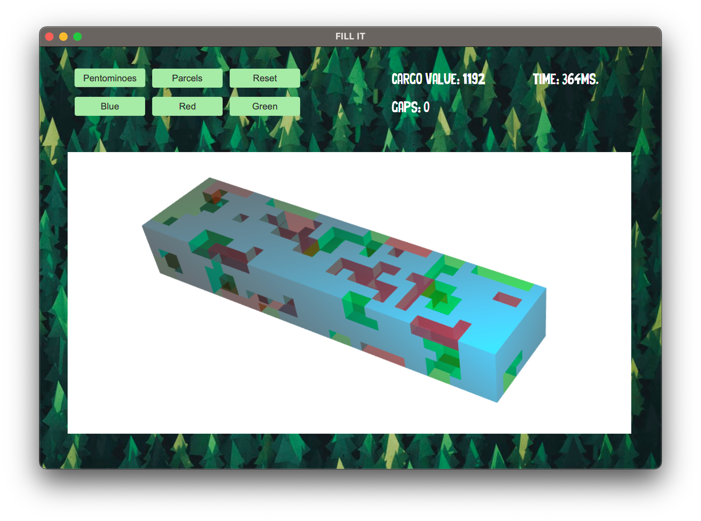
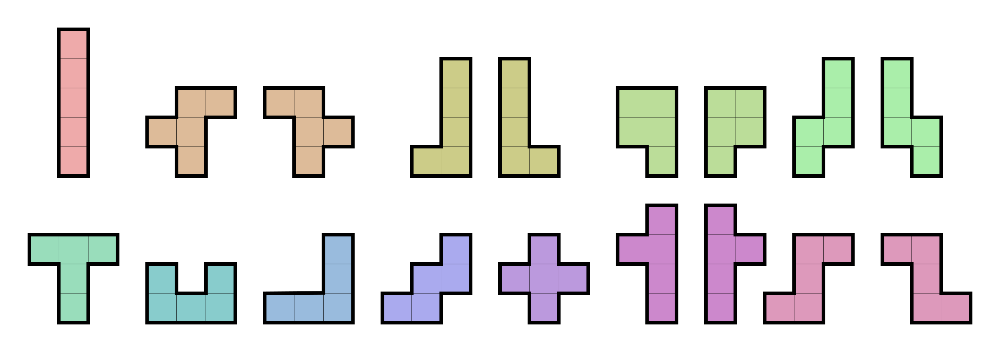
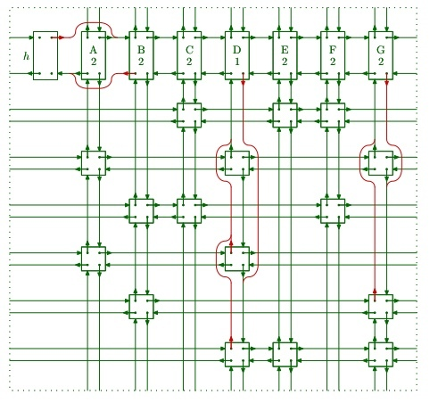

# Knapsack Problem Solver

## Overview

A computer application with a user-friendly interface for solving the three-dimensional knapsack problem.
This project was initially developed as a university group project.



## Table of Contents

- [Knapsack Problem Solver](#knapsack-problem-solver)
    - [Overview](#overview)
    - [Table of Contents](#table-of-contents)
    - [Introduction](#introduction)
    - [Algorithm](#algorithm)
    - [UI](#ui)
    - [Usage](#usage)
    - [Credits](#credits)

## Introduction

The knapsack problem is a classic optimization problem with significant economic implications, especially in the logistics sector. The goal is to determine the most valuable combination of items to include in a knapsack, given a set of items with various sizes and values.

A pentomino is a geometric shape formed by connecting five equal-sized squares edge to edge, often used in recreational mathematics and puzzle-solving. There are 12 different pentominoes.



The project is divided into three phases.
- Phase 1: Solve an exact cover problem with pentominoes on a two-dimensional field with a total size of 60.
- Phase 2: Create a Tetris game with pentomino blocks and a bot that can play automatically.
- Phase 3: Solve the three-dimensional knapsack problem. In this case, try to maximize the value of a cargo container by filling it with no gaps or with the most valuable parcels.

In the following, we will mainly focus on phase 3. To run the code properly, navigate to the directory `PHASE 3`.

## Algorithm

The Dancing Links Algorithm by Donald Knuth is an efficient implementation of Algorithm X (also by Donald Knuth). The algorithm solves an exact cover of a two-dimensional matrix with just zeros and ones. With the implementation of the dancing links, the matrix is represented as a two-dimensional circular doubly linked list with a root node, a head row, and a node for each "one" from the matrix.



In the context of the knapsack problem, it provides an elegant and efficient solution by representing the problem space as a matrix of linked nodes.

The cargo space is divided by 0.5m$^3$ cubes. Each cube is assigned a unique number from 1 to 1320 (assuming our cargo space has the size of 16.5 x 2.5 x 8 meters). When building the matrix for the dancing links algorithm to solve, we first define each block as a column (1320 columns in total). After that, we iterate through every possible placement of a parcel for each parcel and insert this possible placement as a row. A row in particular consists of 5 nodes in all of the columns where the parcel takes place in the space.
After the matrix is built, we run the dancing links algorithm over it to find an exact cover of all columns. The solution will be a stack with all rows that satisfy the exact cover. The stack will be converted to a 3d rendering of the cargo space filled with the parcels.

Since there could be a case that no exact cover can be found, the algorithm will print partial solutions on specific points of the backtracking progress to monitor the highest value that the algorithm could have found up to this point.

## UI

The UI is pretty straightforward. By pressing "Pentominoes" or "Parcels", the algorithm will start with solving. With "Reset" you can stop the algorithm.

The buttons "blue", "red" and "green" can be used to toggle the visibility of parts of the solution.

On the right, the maximum cargo value and the number of gaps are displayed, as well as the time that was needed to get to this partial solution.

## Usage

To use this repository, follow these steps:

1. Clone the repository to your local machine.
   ```bash
   git clone https://github.com/LaurensHei/Knapsack.git
   ```

2. Navigate to the main directory.
   ```bash
   cd PHASE3/src/main/java/nl/group37
   ```

3. Run the program
   ```bash
   javac App.java
   java App
   ```

Note: Make sure you have JavaFX installed and set in the environment.

## Credits

This project is part of a university project from Maastricht University. I worked together with other students. Contact me for more detailed information about the group work.